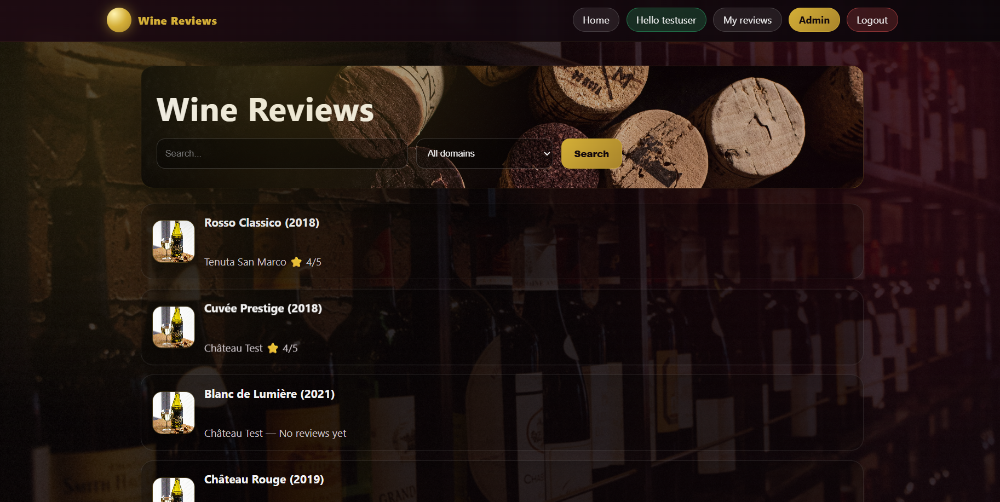
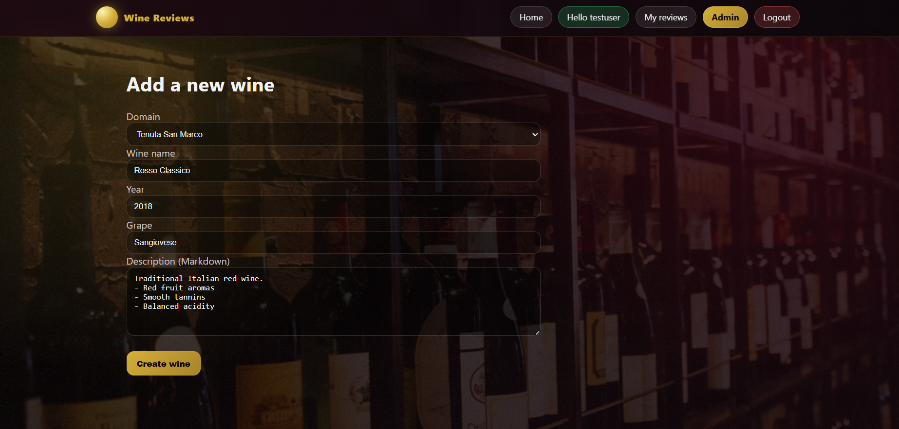
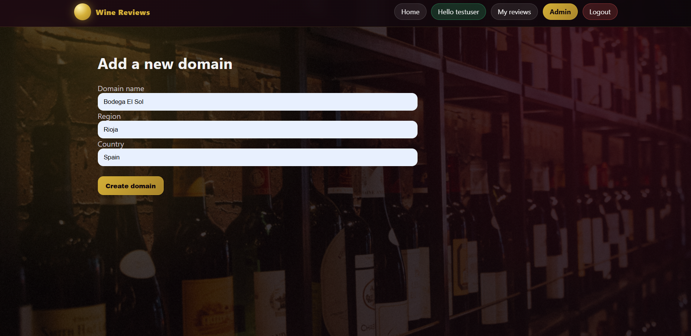

# 🍷 Wine Reviews

Wine Reviews is a full-stack web application that allows users to browse and consult wine reviews through a simple and clean interface. The project also includes an admin side that enables the management of wines and their associated categories (domains). It was developed as a personal portfolio project to practice backend development, database integration, and basic content management.

The application displays a list of wines on the home page and provides dedicated pages for detailed wine reviews. An admin dashboard allows authorized users to add new wines and manage wine domains. All data is stored and managed using a MongoDB database.

The project is built with Node.js and Express for the backend, MongoDB for data persistence (local or Atlas), and EJS templates with CSS for the frontend. Git and GitHub are used for version control, and the project was developed using Visual Studio Code.

Below are some screenshots illustrating the main functionalities of the application.

Home page showing the wine list:
<p align="center">
  
</p>

Wine review detail page:
<p align="center">
  
</p>

Admin page to add a new wine:
<p align="center">
  
</p>

Admin page to manage wine domains:
<p align="center">
  
</p>

To run the project locally, clone the repository and move into the project directory:

```bash
git clone https://github.com/MarouaneAmam/wine-reviews.git
cd wine-reviews
Install the required dependencies:

npm install
Create a .env file at the root of the project and define the following environment variables:

PORT=3000
MONGO_URI=mongodb://127.0.0.1:27017/winereviews
If you are using MongoDB Atlas, replace the MongoDB URI with your own Atlas connection string.

Start the application with:

npm start
Once the server is running, open your browser and navigate to:

http://localhost:3000
The project follows a clear and modular structure that separates routes, views, models, and static assets to keep the codebase organized and maintainable:

wine-reviews/
├── assets/
│   └── screenshots/
├── public/
├── views/
├── routes/
├── models/
├── app.js / server.js
├── .env
├── package.json
└── README.md
This project was developed to demonstrate full-stack web development fundamentals. Possible future improvements include user authentication, advanced search and filtering features, cloud deployment, and automated testing.

Author: Marouane Amam
Master 2 CCI – Distributed Information Systems & Networks (SIRR)
LinkedIn: https://www.linkedin.com/in/amam-marouane

If you find this project useful or interesting, feel free to star the repository.
